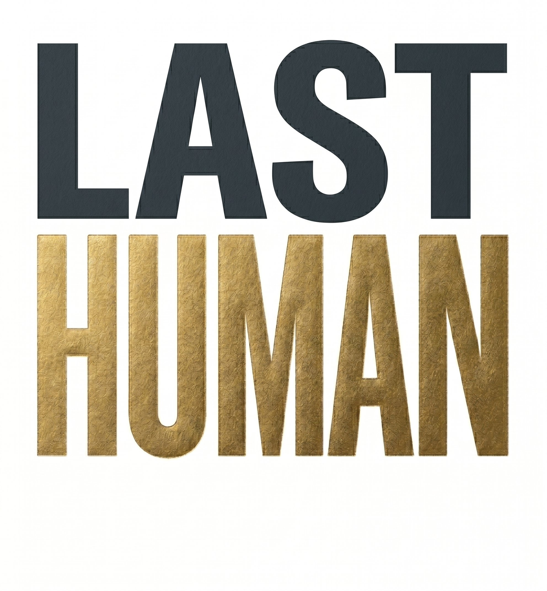

**Working toward the responsible development of artificial intelligence**

_Promoting the ethical and safe use of AI technology for the good of society_

---

## About

LastHuman Foundation (_Fundacja LastHuman_) is an independent nonprofit established in Warsaw, Poland, operating under the Polish Act on Foundations of 6 April 1984. We are dedicated to the responsible development of artificial intelligence and to promoting the ethical and safe use of AI technology for the benefit of society.

Our work is open by default. The tools, research, and educational resources we produce are meant to stay accessible — to practitioners, researchers, policymakers, and the public alike.

## Our mission

The Foundation pursues six interconnected goals, as set out in its statute:

### 🧭 AI Ethics
Shaping ethical frameworks and guidelines for AI development that prioritize human values and social benefit, and creating standards that protect human dignity and rights in the context of advancing technology.

### 🔬 Research
Conducting and supporting research into AI safety, AI alignment with human values, the robustness of AI systems, and the mechanisms that keep artificial intelligence controllable and beneficial for humanity.

### 📚 Education
Helping individuals and communities navigate the digital transformation through education, open learning and training resources, and raising public awareness of the opportunities and risks that come with AI.

### ⚖️ Policy & Advocacy
Informing national and international technology policy through research, advocacy, and collaboration with decision-makers, regulators, and international organizations.

### 🌍 Social Impact
Designing and running programs that address the digital divide and algorithmic bias, and that ensure fair access to the benefits of AI across all social groups and communities.

### 🤝 Human-Centered Design
Promoting and building technological systems and solutions that put people first — ensuring technology serves human needs and aspirations.

## How we work

We pursue these goals through a range of activities, including:

- Conducting and funding research on AI safety, technology ethics, and AI's impact on society
- Organizing conferences, seminars, workshops, training, exhibitions, and hackathons
- Publishing reports, analyses, academic articles, books, podcasts, and educational materials
- Collaborating with academic institutions, universities, NGOs, public bodies, and businesses in Poland and abroad
- Developing recommendations, standards, and guidelines for the ethical development and use of AI
- Advocating for responsible technology policy
- Running social programs that counter digital exclusion and algorithmic bias
- Building online platforms, information portals, applications, and knowledge bases
- Initiating and joining national and international projects, consortia, and partnerships
- Creating mentoring and acceleration programs for innovators working on responsible AI
- Providing consulting and advisory services on AI ethics and responsible deployment

## Repositories

This is the home for the Foundation's open work — tooling, research code, and public resources. Explore the repositories above to see what we're building.

## Get involved

We welcome collaborators, partner organizations, and contributors who share our commitment to human-centered AI.

- 🌐 Website — [lasthuman.today](https://lasthuman.today/)
- 💼 LinkedIn — [company/lasthuman](https://www.linkedin.com/company/lasthuman)
- ✉️ Contact — hello@lasthuman.today

---

LastHuman Foundation · Warsaw, Poland · Building AI that keeps humans in the loop.

